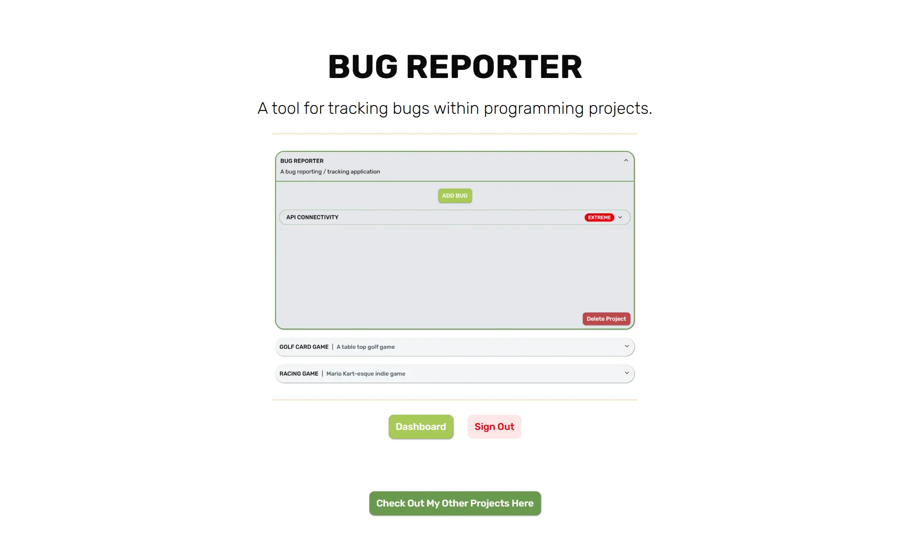

# 👾 BugTracker - Frontend

A dashboard website for managing bugs in programming projects. It allows users to easily track and monitor software bugs with real-time UI updates and type-safe form validation.

---

## 📷 Preview

<!-- Tip: Use a high-quality GIF or screenshot showing the primary interaction in action -->

--- 

## ✨ Key Features & Technical Highlights

* **Project & Bug Management:** Hierarchical issue tracking allowing users to create custom projects and populate them with detailed bug reports through a multi-step wizard.
* **Full Authentication Flow:** Complete user creation with secure login, signup, and logouts powered by cookie `JWT handling`.
* **Asynchronous Server State Sync:** Integrated a custom backend using **TanStack Query** to fetch and update user-specific projects and bugs in real time, utilising its browser caching and automatic revalidation to remain in sync.
* **Strict Type Safety & Schema Validation:** Built with **TypeScript** and **Zod** to guarantee `schema validation` for form inputs and API responses.
* **Modern UI & Accessible Design:** Styled using **Tailwind CSS** and customized **shadcn/ui** components for a responsive, accessible user interface.

---

## 🛠️ Tech Stack & Resources

* **Core Framework & Language:**
  * `TypeScript` - Type-safe application logic and async data fetching.
  * `React` - Component-based UI architecture.
  * `Vercel` - Page hosting.

* **Build & Routing:**
  * `Vite` - Fast development tooling and production bundling.
  * `React Router` - Client-side single page application routing.

* **Data Fetching & Form Handling:**
  * `TanStack Query` - An asynchronous state management library for fetching, caching, and synchronizing server data in React applications.
  * `JS-Cookie` - Secure storage and retrieval of JWT authentication session tokens.
  * `Zod` - Schema validation for robust form handling and payload safety.

* **Styling & Design**
  * `Tailwind CSS` - CSS Utility framework for rapid, consistent and responsive layout design.
  * `Shadcn/UI` - Re-usable and customisable UI components.

---

## 🩹 Known Issues

* **Cache Invalidation:**
> * **On slow network connections, deleted entries may briefly flash when re-entering the dashboard in the same session due to locally stored cache of the entry temporarily being red.**

---

## 🌟 Future Updates

* **Advanced Filtering:** Enable dynamic sorting to allow projects and bugs to be filtered according to user needs.
* **Completed Bugs:** Allow bugs to be marked as complete and filtered out be default, with the option to view this status.

---

## 📃 Credits

* **Rubik Font from Google:** Font used in the project | [Google Fonts](https://fonts.google.com/specimen/Rubik)
* **Magnific from Flaticon:** Bug icon used for the tab image | [Flaticon](https://www.flaticon.com/free-icon/spyware_4773554?term=bug&page=1&position=67&origin=search&related_id=4773554)

---